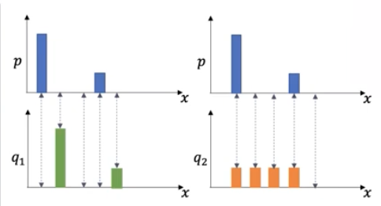
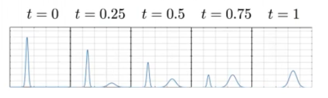
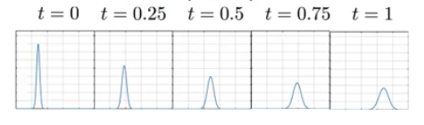

[see resource](https://www.youtube.com/watch?v=xs9uibPODGk)

ML -> important

Measuring dissimilarities between distributions is at the core of Machine learning.

We have many dissimilarity measures:

- $L_p-metrics$ ($p\geq1$)

$$(\int_\mathcal{X}|p(x)-q(x)|^pdx)^\frac{1}{2}$$

- Symmetric chi-squared distances:

$$\int_\mathcal{X}\frac{2(p(x)-q(x))^2}{p(x)+q(x)}dx$$

- Hellinger distance:

$$\left(\frac{1}{2}\int_\mathcal{X}(\sqrt{p(x)}-\sqrt{q(x)})^2dx\right)^\frac{1}{2}$$

- Jensen-Shannon's divergence:

$$D_{JSD}(P||Q)=\frac{1}{2}D_{KL}(P||M)+\frac{1}{2}D_{KL}(Q||M)$$
where $M=\frac{1}{2}(P+Q)$

- or in general $\phi$ -- divergences.

a core problem with this measures is the following:

for all this measures:

$$d(p,q1)>d(p,q_2)$$

but the green distribution is a shifted version of the blue distribution by one bin and this not captured by these.

The reason we need a different measure is that disjoint distributions will return the same maximum value, this has the implication that the derivative is cero on disjoint distributions and there fore cant be minimized.

As opposed to compare distributions in a bin wise matter we need a metric that compare distributions in a cross bin wise matter.

## Optimal transport problem

This is an old mathematical problem:

### Monge's problem (18th century)

for distributions $p=\sum_{i=1}^N \delta_{x_i}$ and $q=\sum_{j=1}^N \delta_{y_j}$

$$\min_sigma \frac{1}{N}\sum_{i=1}^N d(x_i,y_{\sigma(i)})$$

abstractly the problem is equivalent to finding the optimal matching or permutation that provides the cheapest transportation plan to match a set of points $x$ and a set of points $y$

### Kantorovich problem (20th century)

for distributions $p=\sum_{i=1}^N a_i\delta_{x_i}$ and $q=\sum_{j=1}^M b_i\delta_{y_j}$

where $a_i,b_i>0$ and $\sum_{i=1}^N a_i=\sum_{j=1}^M b_j=1$

$$\text{argmin}_\Gamma \sum_{i=1}^N\sum_{j=1}^M d(x_i,y_j)\Gamma_{ij}$$

$$\text{s.t.} \Gamma_{ij} \geq 0, \sum_{i=1}^N \Gamma_{ij}=b_j,\sum_{j=1}^M\Gamma_{ij}=a_i$$

This is a relaxed version with soft assignment where the points with weights can be redistributed.

Both of this problems can be formulated as continuous problems and this is where Wasserstein distance comes from.

### $\rho$-Wasserstein distance

The $\rho$-Wasserstein distance for $\rho \geq 1$ is defined as

$$W_\rho (\mu, \nu) \overset{\text{def}}{=} \left( \min_\gamma \int_\mathcal{X}\int_\mathcal{Y}d^\rho(x,y)\gamma(x,y)dxdy \right)$$

$$\text{s.t.}\gamma(A,Y)=\mu(A),\gamma(X,B)=\nu(B)$$

When the distributions are abdolutely continuous and smooth, a smooth Monge transport map exist:

$$W_\rho (\mu, \nu) \overset{\text{def}}{=} \left( \min_f \int_\mathcal{X} d(x,f(x))^\rho p(x) dx\right)$$

$$\text{s.t.} \det(Df(x))q(f(x))=p(x)$$

- ρ (rho): A parameter ≥ 1 that controls which "power" of the ground distance d(x,y) you penalize. The most common choices are:
    - ρ = 1: gives the Earth Mover's Distance (W₁), which has a nice dual form (Kantorovich-Rubinstein duality with Lipschitz functions).
    - ρ = 2: gives W₂, which is the most widely used in optimal transport theory because it connects to Brenier's theorem, displacement convexity, and has nice geometric properties.
    - Higher ρ penalizes long-range transport more heavily. 

#### 2-Wasserstein geodesics

The shortest path between two distributions is parametrized as 

$$q_t(x)=\det(Df_t(x))q(f_t(x))$$
$$f_t=(1-t)x+tf^*(x), t\in[0,1]$$

and we have $W_2(q_t,q)=tW_2(p,q)$

- Geodesic in the Euclidean space

$$q_t(x)=(1-t)q(x)tp(x)$$

- Geodesic in the 2-Wasserstein Space

$$q_t(x)=\det(Df_t(x))q(f_t(x))$$

We can observe that in the Euclidean, mass is being destroyed on one side and created on the other, but in the wasserstein geodesic the distribution is being moved.

#### Caveat

Optimal transportation is expensive.

for the kantorovich formulation the computational complexity is $\mathcal{O}(N^3\log(N))$

to calculate pairwise Wasserstein distances between a set of probability measires $\{ \mu \}^M_{m=1}$ we need to calculate $\mathcal{O}(M^2)$

## Wasserstein embeddings: Linear Optimal Transport

The key idea is to reduce the computational complexity of pairwise comparisons from $\mathcal{O}(M^2)$ optimal transport problems to $\mathcal{O}(M)$ by fixing a reference measure.

Given a fixed reference distribution $\sigma$, we compute the optimal transport map $f_m$ from $\sigma$ to each distribution $\mu_m$ in our dataset. This defines an **embedding**: each distribution $\mu_m$ is represented by its transport map $f_m$ to the reference.

$$\mu_m \xrightarrow{\text{embed}} f_m \quad \text{where } (f_m)_\# \sigma = \mu_m$$

Once embedded, we work in **transport space** (a linear space of maps) instead of the original signal space. This allows us to:

1. Perform linear operations (e.g., interpolation, PCA) directly on transport maps.
2. Recover distributions by applying the inverse embedding: push the reference $\sigma$ forward through the transport map to obtain the original distribution.

The workflow is: **signal space** $\xrightarrow{\text{embed}}$ **transport space** $\xrightarrow{\text{analysis}}$ **transport space** $\xrightarrow{\text{inverse embed}}$ **signal space** for visualization.

#### Approximation error

The embedding induces a metric that approximates the Wasserstein distance:

$$\hat{W}_2(\mu_i, \mu_j) = \| f_i - f_j \|_{L^2(\sigma)}$$

This is in general only an approximation of $W_2(\mu_i, \mu_j)$. However, if $\mu_i$ and $\mu_j$ are pushforwards of a fixed measure $\mu$ under shifts and scalings (i.e., location-scale families), then the embedding is **isometric**: $\hat{W}_2(\mu_i, \mu_j) = W_2(\mu_i, \mu_j)$.

### Sliced Wasserstein Embeddings

Computing optimal transport in high dimensions is expensive. The **Sliced Wasserstein distance** exploits the fact that in 1D, the Wasserstein distance has a closed-form solution (it reduces to comparing sorted samples / quantile functions).

The idea: project the $d$-dimensional distributions onto 1D by taking inner products with unit directions $\theta \in \mathbb{S}^{d-1}$, compute the 1D Wasserstein distance for each projection, and integrate over all directions:

$$SW_2(\mu, \nu) = \left( \int_{\mathbb{S}^{d-1}} W_2^2(\theta_\#\mu, \theta_\#\nu) \, d\theta \right)^{1/2}$$

where $\theta_\#\mu$ denotes the pushforward of $\mu$ onto the 1D slice along direction $\theta$ (i.e., the distribution of $\langle \theta, x \rangle$ for $x \sim \mu$).

#### Approximation with $K$ slices

In practice, we cannot integrate over all directions on $\mathbb{S}^{d-1}$. Instead, we sample $K$ directions $\{\theta_k\}_{k=1}^K$ uniformly from the unit sphere and approximate:

$$\widehat{SW}_2(\mu, \nu) = \left( \frac{1}{K} \sum_{k=1}^{K} W_2^2(\theta_{k\#}\mu, \theta_{k\#}\nu) \right)^{1/2}$$

Each 1D Wasserstein distance $W_2(\theta_{k\#}\mu, \theta_{k\#}\nu)$ is computed in closed form via sorting, so the total cost scales as $\mathcal{O}(KN\log N)$ for $N$ samples — much cheaper than the full $d$-dimensional OT problem.

The Sliced Wasserstein embedding then works analogously to the LOT embedding: fix a reference $\sigma$, and for each slice direction $\theta_k$, compute the 1D transport map $f_m^{\theta_k}$ from $\theta_{k\#}\sigma$ to $\theta_{k\#}\mu_m$. The collection of $K$ one-dimensional transport maps $\{f_m^{\theta_k}\}_{k=1}^K$ forms the embedding of $\mu_m$.

As $K \to \infty$, $\widehat{SW}_2 \to SW_2$, and the approximation error decreases at rate $\mathcal{O}(K^{-1/2})$.
 